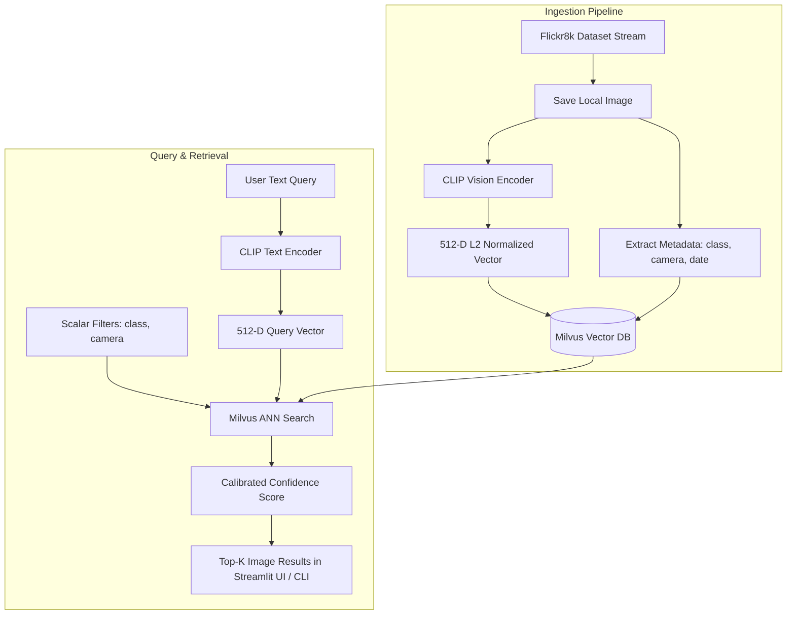

# 🔍 Advanced Milvus Semantic Image Retrieval Engine

An end-to-end multimodal hybrid search engine combining **OpenAI CLIP (ViT-B/32)** embeddings with **Milvus Vector Database** for fast, scalable semantic image retrieval and hybrid scalar filtering.

---

## 📌 Table of Contents
- [Overview](#overview)
- [System Architecture](#system-architecture)
- [Key Features](#key-features)
- [Project Structure](#project-structure)
- [Installation & Setup](#installation--setup)
- [Usage Guide](#usage-guide)
  - [1. Streamlit Web UI](#1-streamlit-web-ui)
  - [2. Interactive CLI Search](#2-interactive-cli-search)
  - [3. Data Ingestion & Indexing](#3-data-ingestion--indexing)
  - [4. Latency & Scale Benchmarking](#4-latency--scale-benchmarking)
- [Metadata Schema & Scalar Filters](#metadata-schema--scalar-filters)
- [Configuration Reference](#configuration-reference)
- [Tech Stack](#tech-stack)

---

## 🌟 Overview

This project implements a production-grade image retrieval system capable of searching thousands of cataloged images using natural language text prompts (e.g., *"a boy doing a skateboard trick"*, *"black dog running in snow"*). 

Instead of relying solely on exact keyword tags, the engine embeds both images and text into a shared **512-dimensional vector space** using CLIP. Nearest-neighbor searches are executed directly against **Milvus Lite** using Cosine similarity alongside boolean scalar filters (such as camera ID and image category).

---

## 🏗️ System Architecture



---

## ✨ Key Features

- **Multimodal Zero-Shot Search**: Natural language text-to-image semantic matching using `openai/clip-vit-base-patch32`.
- **Hybrid Vector + Scalar Search**: Combines ANN (Approximate Nearest Neighbors) vector search with Milvus boolean scalar filters (e.g., `image_class in ["person", "animal"] and camera == "gate-01"`).
- **Interactive Streamlit Web UI**:
  - High-contrast, dark-mode dashboard.
  - Sidebar controls for dynamic Top-K results ($1 \dots 24$).
  - Multi-select filters for category classes and surveillance cameras.
  - Enter-key & button-triggered search.
  - One-click suggestion chips for quick testing.
  - Responsive result cards showing rank badge, calibrated match score (%), raw cosine similarity, and metadata chips.
- **Score Calibration**: Normalizes raw CLIP cosine similarities (~$0.15 \dots 0.35+$) into intuitive human-readable match percentages ($0\% \dots 100\%$).
- **Benchmark Suite**: Scripts to measure cold vs. warm query latency, throughput (QPS), and scaling behavior.


---

## 📁 Project Structure

```text
├── app.py                         # Streamlit interactive web dashboard
├── search.py                      # Interactive command-line search tool
├── index.py                       # Ingestion & embedding pipeline (Flickr8k -> Milvus)
├── models.py                      # CLIP ViT-B/32 vision & text inference wrapper
├── vectordb.py                    # MilvusClient wrapper (schema, index, search, query)
├── config.py                      # Global configuration settings & parameters
├── benchmark_milvus.py            # Latency, throughput, and filter overhead benchmark
├── scalling_test.py               # Synthetic scale benchmark testing
├── requirements.txt               # Python package dependencies
├── .gitignore                     # Git ignore rules for virtualenvs, DBs, and images
└── README.md                      # Project documentation
```


---

## ⚙️ Installation & Setup

### 1. Prerequisites
- Python 3.10 or higher
- Git

### 2. Clone the Repository
```bash
git clone https://github.com/shyamgadhiya/project5-milvus-vector-database.git
cd "Project 5 Advance Milvus Vector Database"
```

### 3. Create & Activate Virtual Environment
- **Windows (PowerShell)**:
  ```powershell
  python -m venv venv
  .\venv\Scripts\Activate.ps1
  ```
- **macOS / Linux**:
  ```bash
  python3 -m venv venv
  source venv/bin/activate
  ```

### 4. Install Dependencies
```bash
pip install -r requirements.txt
```

---

## 🚀 Usage Guide

### 1. Streamlit Web UI
Launch the interactive web interface:
```bash
streamlit run app.py
```
Then navigate to `http://localhost:8501` in your browser.

- **Ask Query**: Type any natural language prompt and press **Enter** or click **Search**.
- **Adjust Top-K**: Use the slider in the sidebar to change the number of retrieved images.
- **Apply Filters**: Select one or more classes (`animal`, `person`, `vehicle`, `nature`, `general`) and cameras (`gate-01`, `gate-02`, `perimeter-east`, `lobby-main`, `warehouse-north`).

---

### 2. Interactive CLI Search
For terminal-based searching:
```bash
python search.py
```
Example session:
```text
Query > A boy does a skateboard trick off a metal plank
Filter (press enter for none) > image_class == 'person'

--- Results for 'A boy does a skateboard trick off a metal plank' ---
Top 1: flickr_4203.jpg | Raw Cosine: 0.3323 | Match: 91.2%
       Class: person   | Cam: lobby-main    | Date: 2026-04-05
       Path: ./image_corpus/flickr_4203.jpg
```

---

### 3. Data Ingestion & Indexing
To stream the Flickr8k dataset, generate CLIP embeddings, and populate the Milvus database:
```bash
python index.py
```
- Ingestion is **idempotent**: existing paths in Milvus are automatically skipped to allow resume-safe runs.

---

### 4. Latency & Scale Benchmarking
Run system performance evaluations:
```bash
# Measure cold/warm search latencies and scalar filter overhead
python benchmark_milvus.py

# Benchmark synthetic scale limits and indexing performance
python scalling_test.py
```

---

## 🗄️ Metadata Schema & Scalar Filters

Milvus collections are initialized with an explicit typed schema:

| Field Name | Type | Description |
| :--- | :--- | :--- |
| `id` | `INT64` | Primary key generated via hash of file path |
| `vector` | `FLOAT_VECTOR(512)` | L2-normalized CLIP ViT-B/32 embedding |
| `file_path` | `VARCHAR(512)` | Relative/absolute disk path to image file |
| `image_class` | `VARCHAR(64)` | Category (`animal`, `person`, `vehicle`, `nature`, `general`) |
| `camera` | `VARCHAR(64)` | Camera device ID (`gate-01`, `lobby-main`, etc.) |
| `capture_date` | `VARCHAR(32)` | Timestamp string (`YYYY-MM-DD`) |
| `source` | `VARCHAR(64)` | Ingestion source identifier |

### Example Filter Expressions
```text
# Filter by class
image_class in ["person", "animal"]

# Filter by camera and class
camera == "gate-01" and image_class == "vehicle"

# Filter by date range or specific dates
capture_date >= "2026-03-01"
```

---

## ⚙️ Configuration Reference (`config.py`)

| Parameter | Default Value | Description |
| :--- | :--- | :--- |
| `MODEL_NAME` | `"openai/clip-vit-base-patch32"` | HuggingFace CLIP model checkpoint |
| `EMBEDDING_DIM` | `512` | Embedding dimensionality |
| `DEVICE` | `"cuda"` if available else `"cpu"` | Inference hardware accelerator |
| `DB_PATH` | `"milvus_project5_lab.db"` | Local Milvus Lite database path |
| `COLLECTION_NAME` | `"image_catalog"` | Target collection name in Milvus |
| `INDEX_TYPE` | `"FLAT"` (or `"HNSW"`) | Vector index structure |
| `METRIC_TYPE` | `"COSINE"` | Similarity measurement metric |
| `LOCAL_IMAGE_DIR` | `"./image_corpus"` | Directory storing downloaded images |
| `BATCH_SIZE` | `32` | Ingestion batch size |
| `DEFAULT_TOP_K` | `3` | Default nearest neighbor count |

---

## 🛠️ Tech Stack

- **Vector Database**: [Milvus Lite / PyMilvus](https://milvus.io/)
- **Embedding Model**: [OpenAI CLIP (Hugging Face Transformers)](https://huggingface.co/openai/clip-vit-base-patch32)
- **Deep Learning Framework**: [PyTorch](https://pytorch.org/)
- **Frontend / Dashboard**: [Streamlit](https://streamlit.io/)
- **Image Processing**: [Pillow (PIL)](https://python-pillow.org/)
- **Dataset Streaming**: [Hugging Face Datasets](https://huggingface.co/docs/datasets/)
